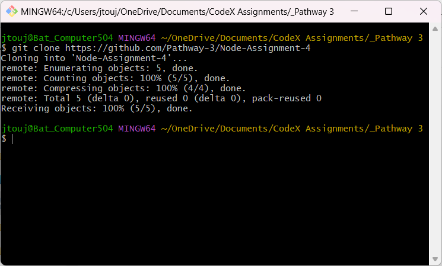

# Node-Assignment-4

This assignment is about putting my own npm to the website. Then install the npm that I created in another file for the project.

## Cloned the repo.

With the terminal I cloned down my respository.

