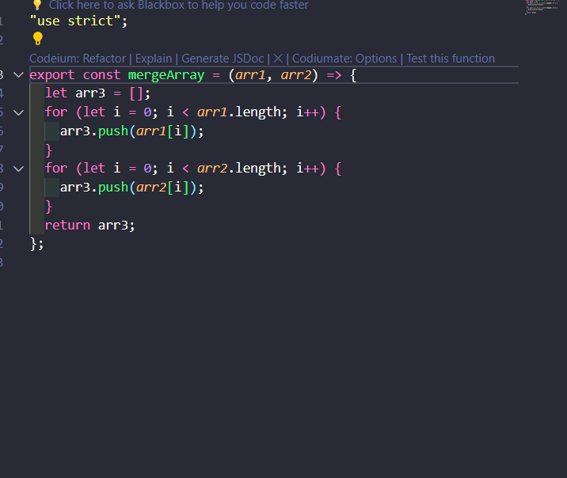
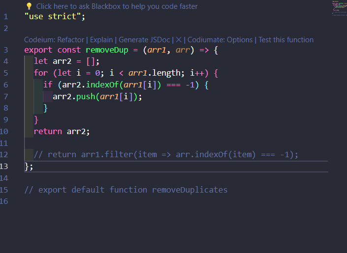

# Node-Assignment-4

This assignment is about putting my npm on the website. Then install the npm that I created in another file for the project.

## Cloned the repo.

With the terminal I cloned down my respository.

## Repository

When the repository was created I created a README file with a License and a .gitignore file that contains my test files.

## License

This project is licensed under the MIT license.

## Javascipt

### Merge Arrays

This is my script that I used to merge arrays. This script will merge my arrays into one array.

### Remove Duplitate Arrays

This is my script that I used to remove duplicate arrays from a main array. It will take an array of arrays and return a new array with no duplicates.

## NPM Login

I logged in with npm using the command `npm login` and entered my username, password, and email address for authentication. and published my npm module.

